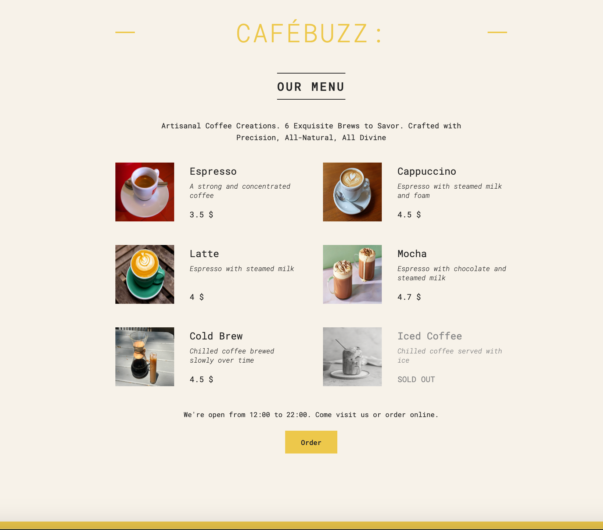

# Cafebuzz - Your Guide to React Development

*Caption: This is the main user interface of Cafebuzz, displaying a selection of virtual coffee options.*

Welcome to Cafebuzz, an interactive virtual coffee shop menu, and your go-to resource for learning and practicing React development. In this repository, you'll find an application that showcases the implementation of JSX, React 18, state management, and various fundamental React concepts. Whether you're a beginner eager to dive into web development or an experienced developer looking to explore React further, Cafebuzz is designed to guide you on your journey.

## What You'll Discover

- **React JSX**: Dive into the world of JSX and learn how to create dynamic and interactive user interfaces for web applications.

- **React 18**: Explore the latest features and enhancements introduced in React 18, making your projects more powerful and efficient.

- **State Management**: Understand how to manage and manipulate application state using React's state management capabilities, including hooks.

- **React Concepts**: Cafebuzz is a playground for various React concepts, including components, props, and more. Learn by doing and experimenting with real-world examples.

## Getting Started

To get started with Cafebuzz, follow these simple steps:

1. Clone this repository to your local machine.
2. Install any necessary dependencies by running `npm install`
3. Start the development server with `npm run dev`.
4. Open your browser and navigate to `http://127.0.0.1:5173/` to see Cafebuzz in action.

Feel free to explore the code, make modifications, and expand your understanding of React. Share your knowledge with the community, and let's grow together!

## Contributing

Cafebuzz is an open-source project, and we welcome contributions from developers of all levels. If you have ideas, suggestions, or improvements to share, please submit pull requests and collaborate with us.

Happy coding and enjoy your journey through the world of React development with Cafebuzz!
